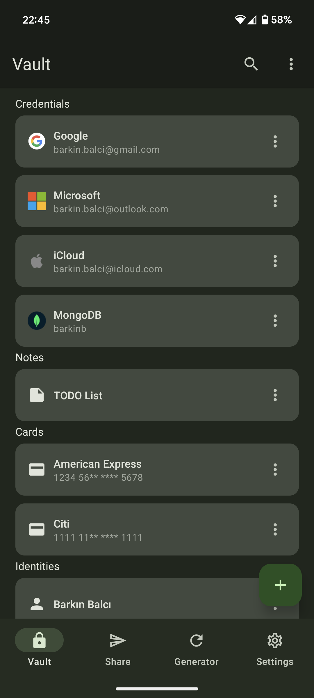
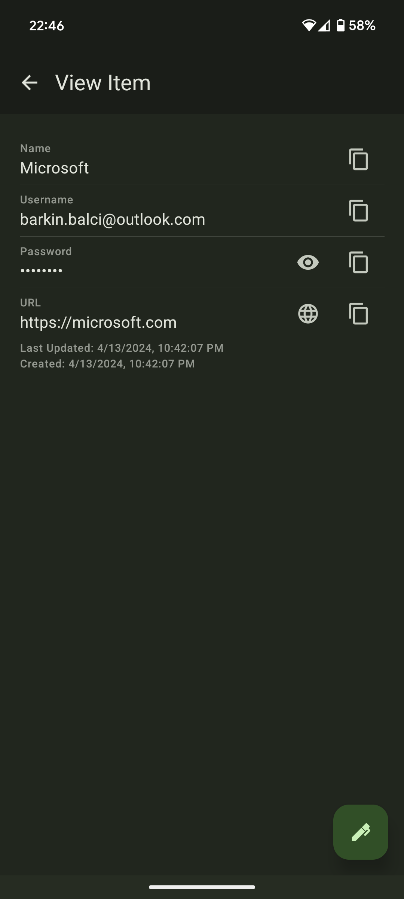
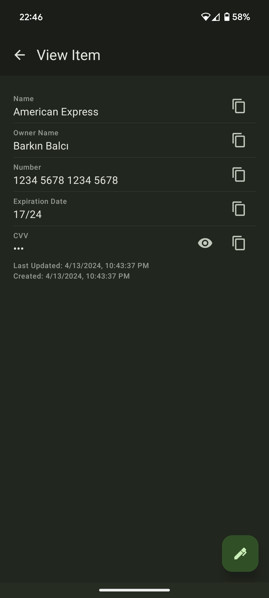

# Coilcrypt Mobile

<p>
  <!-- iOS -->
  
  <!-- Android -->
  
</p>

CoilCrypt is a mobile application built with React Native and Expo that allows users to securely store and manage their sensitive information, such as login credentials, notes, credit card details, and identities.

## 🚀 Features

- Encryption: All data is encrypted using AES-256 with PBKDF2 key derivation, ensuring maximum security for your information.
- Organization: Organize your data into categories like logins, notes, cards, and identities for easy access.
- Password Generator: Generate strong and unique passwords with customizable length and character options.
- Sharing: Share specific items securely with other CoilCrypt users (future feature).
- Offline Mode: Access your data even when you're offline.
- Cross-Platform: Works seamlessly on both iOS and Android devices.

<p>
  
  
  
  
</p>

## 🏃 Getting Started

- Build/Run on iOS 🍎

```
yarn ios
```

```
npm run ios
```

- Build/Run on Android 🤖

```
yarn android
```

```
npm run android
```

## 💻 Start the Dev Client

```
expo start --dev-client
```

```
yarn start
```

```
npm run start
```
